# Laporan Jarkom Modul 3 Kelompok K-36

## Anggota

| Nama | NRP|
|-------------------------------|---------------|
| Ahmad Wildan Fawwaz| 5027241001 |
| Muhammad Rakha Hananditya R.| 5027241015 |

## Asisten Penguji
| Nama | Kode Asisten |
|-----------------------|----|
| Revalina Fairuzy Azhari Putri | P4 |

## Pendahuluan

بِسْمِ اللَّهِ الرَّحْمَنِ الرَّحِيْمِ

<p align="justify">
&emsp; Segala puji syukur kita panjatkan atas kehadirat Allah Subḥānahu wa Ta‘ālā, karena berkat atas rahmat, karunia, dan nikmat-Nya praktikum modul 1 untuk mata kuliah Komunikasi Data dan Jaringan Komputer dapat diselesaikan dengan cukup. Tidak lupa shalawat serta salam semoga senantiasa tercurah kepada junjungan kita Nabi Muhammad Shallallāhu ‘alaihi wa Sallam, suri teladan terbaik bagi umat manusia, beserta keluarga, sahabat, dan para pengikutnya hingga akhir zaman.
</p>

<p align="justify">
&emsp; Laporan ini disusun sebagai suatu bentuk pertanggungjawaban akademik atas kegiatan praktikum yang telah dilaksanakan. Selain itu, laporan ini berfungsi sebagai dokumentasi resmi tertulis dari seluruh rangkaian kegiatan yang telah dilakukan, sehingga dapat menjadi acuan dalam evaluasi maupun penilaian praktikum.
</p>

Rasulullah Shallallāhu ‘alaihi wa Sallam pernah bersabda:

إِذَا مَاتَ ابْنُ آدَمَ انْقَطَعَ عَمَلُهُ إِلَّا مِنْ ثَلَاثٍ: صَدَقَةٍ جَارِيَةٍ، أَوْ عِلْمٍ يُنْتَفَعُ بِهِ، أَوْ وَلَدٍ صَالِحٍ يَدْعُو لَهُ


<em>Artinya</em>:
<p align="justify">
"Apabila anak Adam meninggal dunia, maka terputuslah amalnya kecuali tiga perkara: sedekah jariyah, ilmu yang bermanfaat, atau anak shalih yang mendoakannya." 
<br>
(HR. Muslim, no. 1631)
</p>
  
وَمَنْ سَلَكَ طَرِيقًا يَلْتَمِسُ فِيهِ عِلْمًا سَهَّلَ اللَّهُ لَهُ بِهِ طَرِيقًا إِلَى الْجَنَّةِ

<em>Artinya</em>:
<p align="justify">
"Barang siapa yang menempuh jalan untuk mencari ilmu, maka Allah akan mudahkan baginya jalan menuju surga." 
 <br>
(HR. Muslim, no. 2699)
</p>
  
<p align="justify">
&emsp; Maka dari itu, semoga apa yang tertulis pada laporan ini dapat menjadi ilmu yang bermanfaat, serta menjadi keberkahan dan amal yang diterima di sisi Allah Subḥānahu wa Ta‘ālā. Semoga bagi yang membaca ini, Allah memudahkan semua langkahnya dalam menuntut ilmu, mengamalkannya, serta menjaganya agar tidak sekadar menjadi hafalan, namun juga menjadi bekal yang membawanya ke surga.
</p>

Āmīn yā Rabbal ‘ālamīn.

## Daftar Isi

- [Anggota](#anggota)
- [Pendahuluan](#pendahuluan)
- [Daftar Isi](#daftar-isi)
- [Walkthrough](#walkthrough)
	- [Soal 1](#-soal-1)
	- [Soal 2](#-soal-2)
 	- [Soal 3](#-soal-3)
  	- [Soal 4](#-soal-4)
  	- [Soal 5](#-soal-5)
  	- [Soal 6](#-soal-6)
  	- [Soal 7](#-soal-7)
  	- [Soal 8](#-soal-8)
  	- [Soal 9](#-soal-9)
  	- [Soal 10](#-soal-10)
  	- [Soal 11](#-soal-11)
  	- [Soal 12](#-soal-12)
  	- [Soal 13](#-soal-13)
  	- [Soal 14](#-soal-14)
  	- [Soal 15](#-soal-15)
  	- [Soal 16](#-soal-16)
  	- [Soal 17](#-soal-17)
  	- [Soal 18](#-soal-18)
  	- [Soal 19](#-soal-19)
  	- [Soal 20](#-soal-20)
- [Kendala Pengerjaan](#kendala-pengerjaan)
- [Revisi](#revisi)

## Walkthrough

### • Soal 1

<blockquote>
	<ol>
		<li>
			<p align="justify">
				Di awal Zaman Kedua, setelah kehancuran Beleriand, para Valar menugaskan untuk membangun kembali jaringan komunikasi antar kerajaan. Para Valar menyalakan Minastir, Aldarion, Erendis, Amdir, Palantir, Narvi, Elros, Pharazon, Elendil, Isildur, Anarion, Galadriel, Celeborn, Oropher, Miriel, Amandil, Gilgalad, Celebrimbor, Khamul, dan pastikan setiap node (selain Durin sang penghubung antar dunia) dapat sementara berkomunikasi dengan Valinor/Internet (nameserver 192.168.122.1) untuk menerima instruksi awal.
			</p>
		</li>
	</ol>
</blockquote>

<p align="justify">
&emsp; Langkah pertama adalah menyusun topologi jaringannya terlebih dahulu dan menghubungkan link antar node sesuai ketentuan soal.
</p>

<p align="center">
	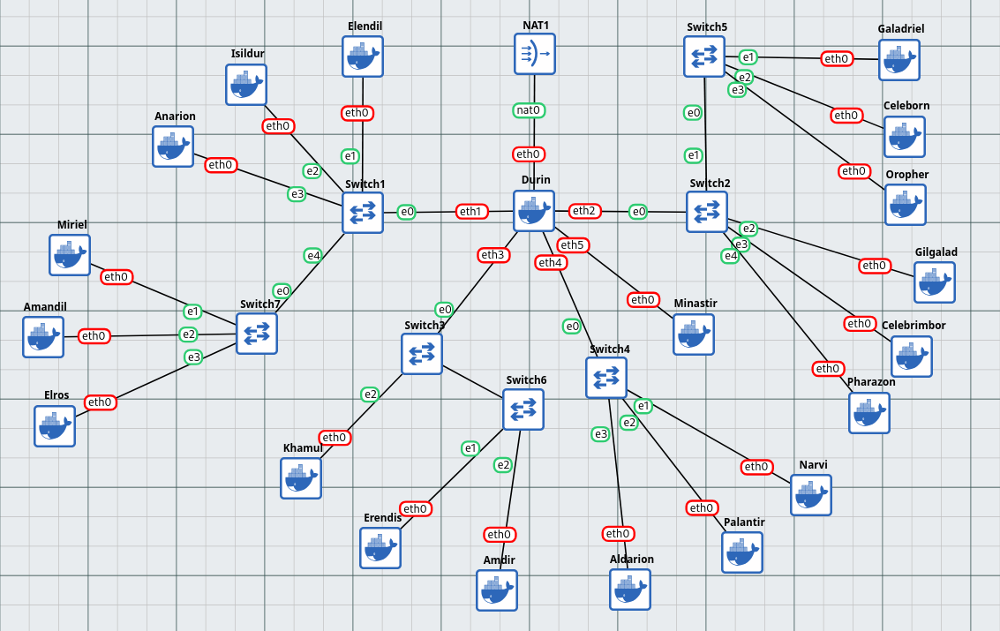  
</p>

<p align="justify">
&emsp; Setelah itu, untuk memastikan bahwa setiap node dapat berkomunikasi dengan internet, maka kita dapat beralih ke menu <code>Configure > Edit Network Configuration</code> untuk setiap node yang ada.
</p>

<p align="center">
	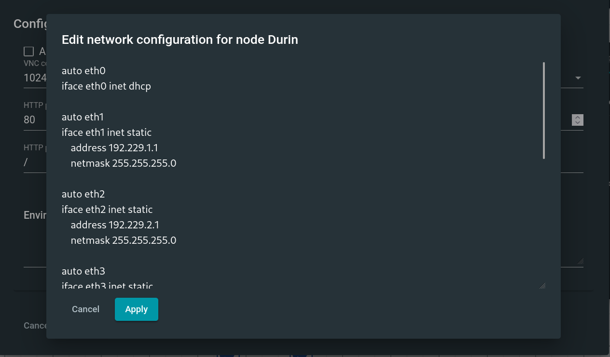  
</p>

Di mana ketentuan untuk setiap nodenya:

1. **Durin**

```bash
auto eth0
iface eth0 inet dhcp

auto eth1
iface eth1 inet static
    address 192.229.1.1
    netmask 255.255.255.0

auto eth2
iface eth2 inet static
    address 192.229.2.1
    netmask 255.255.255.0

auto eth3
iface eth3 inet static
    address 192.229.3.1
    netmask 255.255.255.0

auto eth4
iface eth4 inet static
    address 192.229.4.1
    netmask 255.255.255.0

auto eth5
iface eth5 inet static
    address 192.229.5.1
    netmask 255.255.255.0

up sh -c 'iptables -t nat -A POSTROUTING -o eth0 -j MASQUERADE'
```

2. **Elendil**

```bash
auto eth0
iface eth0 inet static
	address 192.229.1.101
	netmask 255.255.255.0
	gateway 192.229.1.1

up sh -c 'echo "nameserver 192.168.122.1" > /etc/resolv.conf'
```

3. **Isildur**

```bash
auto eth0
iface eth0 inet static
	address 192.229.1.102
	netmask 255.255.255.0
	gateway 192.229.1.1

up sh -c 'echo "nameserver 192.168.122.1" > /etc/resolv.conf'
```

4. **Anarion**

```bash
auto eth0
iface eth0 inet static
	address 192.229.1.103
	netmask 255.255.255.0
	gateway 192.229.1.1

up sh -c 'echo "nameserver 192.168.122.1" > /etc/resolv.conf'
```

5. **Miriel**

```bash
auto eth0
iface eth0 inet static
	address 192.229.1.104
	netmask 255.255.255.0
	gateway 192.229.1.1

up sh -c 'echo "nameserver 192.168.122.1" > /etc/resolv.conf'
```

6. **Elros**

```bash
auto eth0
iface eth0 inet static
	address 192.229.1.105
	netmask 255.255.255.0
	gateway 192.229.1.1

up sh -c 'echo "nameserver 192.168.122.1" > /etc/resolv.conf'
```

7. **Amandil**

```bash
auto eth0
iface eth0 inet dhcp
```

8. **Galadriel**

```bash
auto eth0
iface eth0 inet static
	address 192.229.2.101
	netmask 255.255.255.0
	gateway 192.229.2.1

up sh -c 'echo "nameserver 192.168.122.1" > /etc/resolv.conf'
```

9. **Celeborn**

```bash
auto eth0
iface eth0 inet static
	address 192.229.2.102
	netmask 255.255.255.0
	gateway 192.229.2.1

up sh -c 'echo "nameserver 192.168.122.1" > /etc/resolv.conf'
```

10. **Oropher**

```bash
auto eth0
iface eth0 inet static
	address 192.229.2.103
	netmask 255.255.255.0
	gateway 192.229.2.1

up sh -c 'echo "nameserver 192.168.122.1" > /etc/resolv.conf'
```

11. **Celebrimbor**

```bash
auto eth0
iface eth0 inet static
	address 192.229.2.104
	netmask 255.255.255.0
	gateway 192.229.2.1

up sh -c 'echo "nameserver 192.168.122.1" > /etc/resolv.conf'
```

12. **Pharazon**

```bash
auto eth0
iface eth0 inet static
	address 192.229.2.105
	netmask 255.255.255.0
	gateway 192.229.2.1

up sh -c 'echo "nameserver 192.168.122.1" > /etc/resolv.conf'
```

13. **Gilgalad**

```bash
auto eth0
iface eth0 inet dhcp
```

14. **Khamul**

```bash
auto eth0
iface eth0 inet dhcp
```

15. **Erendis**

```bash
auto eth0
iface eth0 inet static
	address 192.229.3.101
	netmask 255.255.255.0
	gateway 192.229.3.1

up sh -c 'echo "nameserver 192.168.122.1" > /etc/resolv.conf'
```

16. **Amdir**

```bash
auto eth0
iface eth0 inet static
	address 192.229.3.102
	netmask 255.255.255.0
	gateway 192.229.3.1

up sh -c 'echo "nameserver 192.168.122.1" > /etc/resolv.conf'
```

17. **Aldarion**

```bash
auto eth0
iface eth0 inet static
	address 192.229.4.101
	netmask 255.255.255.0
	gateway 192.229.4.1

up sh -c 'echo "nameserver 192.168.122.1" > /etc/resolv.conf'
```

18. **Palantir**

```bash
auto eth0
iface eth0 inet static
	address 192.229.4.102
	netmask 255.255.255.0
	gateway 192.229.4.1

up sh -c 'echo "nameserver 192.168.122.1" > /etc/resolv.conf'
```

19. **Narvi**

```bash
auto eth0
iface eth0 inet static
	address 192.229.4.103
	netmask 255.255.255.0
	gateway 192.229.4.1

up sh -c 'echo "nameserver 192.168.122.1" > /etc/resolv.conf'
```

20. **Minastir**

```bash
auto eth0
iface eth0 inet static
	address 192.229.5.101
	netmask 255.255.255.0
	gateway 192.229.5.1

up sh -c 'echo "nameserver 192.168.122.1" > /etc/resolv.conf'
```

### • Soal 2

<blockquote>
	<ol start="2">
		<li>
			<p align="justify">
				Raja Pelaut Aldarion, penguasa wilayah Númenor, memutuskan cara pembagian tanah client secara dinamis. Ia menetapkan:
			</p>
			<ul>
				<li>Client Dinamis Keluarga Manusia: Mendapatkan tanah di rentang [prefix ip].1.6 - [prefix ip].1.34 dan [prefix ip].1.68 - [prefix ip].1.94.</li>
				<li>Client Dinamis Keluarga Peri: Mendapatkan tanah di rentang [prefix ip].2.35 - [prefix ip].2.67 dan [prefix ip].2.96 - [prefix ip].2.121.</li>
				<li>Khamul yang misterius: Diberikan tanah tetap di [prefix ip].3.95, agar keberadaannya selalu diketahui. Pastikan Durin dapat menyampaikan dekrit ini ke semua wilayah yang terhubung dengannya.</li>
		</li>
	</ol>
</blockquote>

<p align="justify">
&emsp; Untuk menetapkan range pool IP untuk client dinamis, maka kita perlu mengkonfigurasi terlebih dahulu <b>DHCP Server (Aldarion)</b> dan <b>DHCP Relay (Durin)</b>. Di mana langkah implementasinya:
</p>

#### • DHCP Server

1. Memperbarui daftar package yang ada pada apt-get.

```bash
apt-get update
```

2. Menginstall `isc-dhcp-server`.

```bash
apt-get install isc-dhcp-server -y
```

3. Membuat file konfigurasi `/etc/default/isc-dhcp-server` dan menetapkan interface yang digunakan DHCP Server untuk mendengar request DHCP.

```bash
cat > /etc/default/isc-dhcp-server << 'EOF'
INTERFACESv4="eth0"
EOF
```

4. Membuat file konfigurasi `/etc/dhcp/dhcpd.conf` dan menetapkan interface range pool IP yang disediakan oleh server dengan mengikuti ketentuan soal.

```bash
cat > /etc/dhcp/dhcpd.conf << 'EOF'
default-lease-time 600;
max-lease-time 7200;
authoritative;

subnet 192.229.1.0 netmask 255.255.255.0 {
    option routers 192.229.1.1;
    option subnet-mask 255.255.255.0;
    option broadcast-address 192.229.1.255;
    option domain-name-servers 192.168.122.1;
    range 192.229.1.6 192.229.1.34;
    range 192.229.1.68 192.229.1.94;
}

subnet 192.229.2.0 netmask 255.255.255.0 {
    option routers 192.229.2.1;
    option subnet-mask 255.255.255.0;
    option broadcast-address 192.229.2.255;
    option domain-name-servers 192.168.122.1;
    range 192.229.2.35 192.229.2.67;
    range 192.229.2.96 192.229.2.121;
}

subnet 192.229.3.0 netmask 255.255.255.0 {
    option routers 192.229.3.1;
    option subnet-mask 255.255.255.0;
    option broadcast-address 192.229.3.255;
    option domain-name-servers 192.168.122.1;
}

host Khamul {
    hardware ethernet 02:42:4c:b6:e5:00;
    fixed-address 192.229.3.95;
}

subnet 192.229.4.0 netmask 255.255.255.0 {
    option routers 192.229.4.1;
    option subnet-mask 255.255.255.0;
    option broadcast-address 192.229.4.255;
    option domain-name-servers 192.168.122.1;
}
EOF
```

5. Melakukan restart pada service `isc-dhcp-server`.

```bash
service isc-dhcp-server restart
```

#### • DHCP Relay

6. Memperbarui daftar package yang ada pada apt-get.

```bash
apt-get update
```

7. Menginstall `isc-dhcp-relay`.

```bash
apt-get install isc-dhcp-relay -y
```

8. Membuat file konfigurasi `/etc/default/isc-dhcp-relay` dan menetapkan alamat dari DHCP Server dan interface yang digunakan DHCP Relay untuk meneruskan request DHCP.

```bash
cat > /etc/default/isc-dhcp-relay << 'EOF'
SERVERS="192.229.4.101"
INTERFACES="eth1 eth2 eth3 eth4 eth5"
OPTIONS=""
EOF
```

9. Membuat file konfigurasi `/etc/sysctl.conf` dan menetapkan fungsi IP forwarding pada sistem.

```bash
cat > /etc/sysctl.conf << 'EOF'
net.ipv4.ip_forward=1
EOF
```

10. Memuat ulang konfigurasi sistem.

```bash
sysctl -p
```

11. Melakukan restart pada service `isc-dhcp-relay`.

```bash
service isc-dhcp-relay restart
```

<p align="justify">
&emsp; Terakhir, kita perlu memverifikasi bahwasannya client dinamis dapat menerima offer IP address dari DHCP Server dan menggunakan IP address tersebut.
</p>

<p align="center">
	  
</p>

<p align="center">
	  
</p>

<p align="center">
	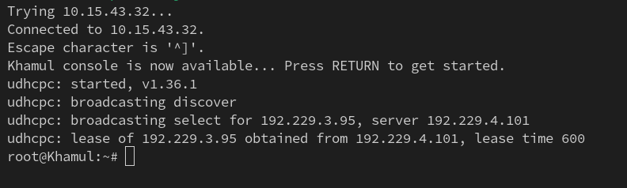  
</p>

<p align="justify">
&emsp; Berdasarkan screenshot di atas, dapat disimpulkan bahwasannya client dinamis, yaitu Amandil, Gilgalad, dan Khamul berhasil mendapatkan IP address sesuai ketentuan range pool pada soal.
</p>

### • Soal 3

<blockquote>
	<ol start="3">
		<li>
			<p align="justify">
				Untuk mengontrol arus informasi ke dunia luar (Valinor/Internet), sebuah menara pengawas, Minastir didirikan. Minastir mengatur agar semua node (kecuali Durin) hanya dapat mengirim pesan ke luar Arda setelah melewati pemeriksaan di Minastir.
			</p>
		</li>
	</ol>
</blockquote>

<p align="justify">
&emsp; Untuk mengarahkan query dari node lain (kecuali Durin) ke Minastir, maka kita perlu mengkonfigurasi terlebih dahulu Minastir sebagai <b>DNS Forwarder</b>. Di mana langkah implementasinya:
</p>

1. Memperbarui daftar package yang ada pada apt-get.

```bash
apt-get update
```

2. Menginstall `dnsmasq`.

```bash
apt-get install dnsmasq -y
```

3. Membuat file konfigurasi `/etc/dnsmasq.conf` dan menetapkan Minastir sebagai DNS Forwarder, yang meliputi interface yang digunakan untuk mendengarkan query dari node lain (kecuali Durin) dan logging query yang melewati DNS Forwarder.

```bash
cat > /etc/dnsmasq.conf << 'EOF'
no-resolv
no-poll

interface=eth0
bind-interfaces
server=192.168.122.1
log-queries
log-facility=/var/log/dnsmasq.log
neg-ttl=60
cache-size=500
EOF
```

4. Memuat ulang konfigurasi sistem.

```bash
sysctl -p
```

5. Melakukan restart pada service `dnsmasq`.

```bash
service dnsmasq restart
```

<p align="justify">
&emsp; Selain itu, kita perlu mengubah konfigurasi nameserver yang ditetapkan pada DHCP Server. Di mana langkah implementasinya:
</p>

6. Memperbarui file konfigurasi `/etc/dhcp/dhcpd.conf` dan menetapkan IP address dari DNS Forwarder sebagai nameserver.

```bash
cat > /etc/dhcp/dhcpd.conf << 'EOF'
default-lease-time 600;
max-lease-time 7200;
authoritative;

subnet 192.229.1.0 netmask 255.255.255.0 {
    option routers 192.229.1.1;
    option subnet-mask 255.255.255.0;
    option broadcast-address 192.229.1.255;
    option domain-name-servers 192.229.5.101;
    range 192.229.1.6 192.229.1.34;
    range 192.229.1.68 192.229.1.94;
}

subnet 192.229.2.0 netmask 255.255.255.0 {
    option routers 192.229.2.1;
    option subnet-mask 255.255.255.0;
    option broadcast-address 192.229.2.255;
    option domain-name-servers 192.229.5.101;
    range 192.229.2.35 192.229.2.67;
    range 192.229.2.96 192.229.2.121;
}

subnet 192.229.3.0 netmask 255.255.255.0 {
    option routers 192.229.3.1;
    option subnet-mask 255.255.255.0;
    option broadcast-address 192.229.3.255;
    option domain-name-servers 192.229.5.101;
}

host Khamul {
    hardware ethernet 02:42:4c:b6:e5:00;
    fixed-address 192.229.3.95;
}

subnet 192.229.4.0 netmask 255.255.255.0 {
    option routers 192.229.4.1;
    option subnet-mask 255.255.255.0;
    option broadcast-address 192.229.4.255;
    option domain-name-servers 192.229.5.101;
}
EOF
```

7. Melakukan restart pada service `isc-dhcp-server`.

```bash
service isc-dhcp-server restart
```

<p align="justify">
&emsp; Terakhir, kita perlu memverifikasi bahwasannya semua query yang berasal dari node lain (kecuali Durin) melewati DNS Forwarder terlebih dahulu. Di mana kita dapat menggunakan command <code>nslookup</code>, dengan menggunakan <b>Aldarion</b> sebagai contoh:
</p>

```bash
nslookup google.com
```

<p align="center">
	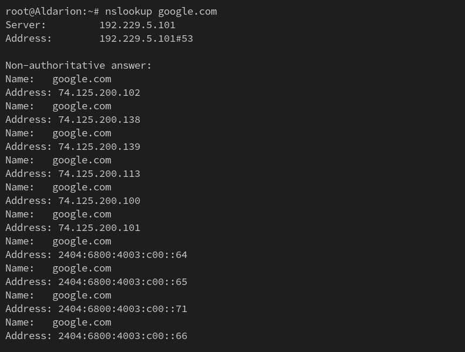  
</p>

<p align="justify">
&emsp; Berdasarkan screenshot di atas, dapat disimpulkan bahwasannya query dari Aldarion diarahkan terlebih dahulu ke DNS Forwarder, dibuktikan dengan IP address asal dari <code>nslookup</code> yang bukan menunjukkan IP dari Aldarion, melainkan IP dari DNS Forwarder (Minastir).
</p>

### • Soal 4

<blockquote>
	<ol start="4">
		<li>
			<p align="justify">
				Ratu Erendis, sang pembuat peta, menetapkan nama resmi untuk wilayah utama (&lt;xxxx&gt;.com). Ia menunjuk dirinya (ns1.&lt;xxxx&gt;.com) dan muridnya Amdir (ns2.&lt;xxxx&gt;.com) sebagai penjaga peta resmi. Setiap lokasi penting (Palantir, Elros, Pharazon, Elendil, Isildur, Anarion, Galadriel, Celeborn, Oropher) diberikan nama domain unik yang menunjuk ke lokasi fisik tanah mereka. Pastikan Amdir selalu menyalin peta (master-slave) dari Erendis dengan setia.
			</p>
		</li>
	</ol>
</blockquote>

<p align="justify">
&emsp; Sebelum dapat membuat zona DNS pada Erendis, maka langkah pertama adalah menginstall <b>Bind9</b> pada console <b>Erendis</b> terlebih dahulu. Di mana langkah implementasinya adalah:
</p>

1. Memperbarui daftar package yang ada pada apt-get.

```bash
apt-get update
```

2. Menginstall `bind9`.

```bash
apt-get install bind9 -y
```

3. Membuat link simbolik `/etc/init.d/bind9` yang merujuk ke `/etc/init.d/named`.

```bash
ln -s /etc/init.d/named /etc/init.d/bind9
```

<p align="justify">
&emsp; Kemudian setelah menginstall bind9, kita perlu melakukan konfigurasi domain terlebih dahulu pada file <code>/etc/bind/named.conf.local</code>. Di mana langkah implementasinya adalah:
</p>

4. Membuat file konfigurasi `/etc/bind/named.conf.local` dan menetapkan zona DNS `K36.com` dengan tipe `master` untuk Erendis.

```bash
cat > /etc/bind/named.conf.local <<'EOF'
zone "K36.com" {
        type master;
        file "/etc/bind/ns1/K36.com";
        allow-transfer { 192.229.3.102; };
        also-notify { 192.229.3.102; };
        notify yes;
};
EOF
```

5. Membuat direktori `/etc/bind/ns1`.

```bash
mkdir -p /etc/bind/ns1
```

6. Mengalihkan kepemilikan direktori `/etc/bind/ns1` ke user `bind`.
```bash
chown bind:bind /etc/bind/ns1
```

<p align="justify">
Langkah selanjutnya adalah membuat file zona DNS otoritatif pada Erendis, di mana ketentuannya:
	<ul>
		<li>
			Start of Authority (SOA) yang merujuk ke nama domain <code>ns1.K36.com</code>.
		</li>
		<li>
			Nameserver Record (NS) untuk nama domain <code>ns1.K36.com</code> dan <code>ns2.K36.com</code>.
		</li>
		<li>
			Address Record (A) untuk IP address dari node <b>Erendis</b> yang merujuk ke nama domain <code>ns1.K36.com</code>. 
		</li>
		<li>
			Address Record (A) untuk IP address dari node <b>Amdir</b> yang merujuk ke nama domain <code>ns2.K36.com</code>. 
		</li>
		<li>
			Address Record (A) untuk IP address dari node <b>Erendis</b> yang merujuk ke nama domain apex (@) <code>K36.com</code>. 
		</li>
		<li>
			Address Record (A) untuk IP address dari node <b>Elendil</b>, <b>Isildur</b>, <b>Anarion</b>, <b>Elros</b>, <b>Galadriel</b>, <b>Celeborn</b>, <b>Oropher</b>, <b>Pharazon</b>, dan <b>Palantir</b>. 
		</li>
	</ul>
Dengan langkah implementasinya:
</p>

7. Membuat file record zona DNS template pada `/etc/bind/zone.template`.

```bash
cat > /etc/bind/zone.template <<'EOF'
$TTL    604800          ; Waktu cache default (detik)
@       IN      SOA     localhost. root.localhost. (
                        2025100401 ; Serial (format YYYYMMDDXX)
                        604800     ; Refresh (1 minggu)
                        86400      ; Retry (1 hari)
                        2419200    ; Expire (4 minggu)
                        604800 )   ; Negative Cache TTL
;

@       IN      NS      localhost.
@       IN      A       127.0.0.1
EOF
```

8. Menyalin file template ke direktori `/etc/bind/ns1` dengan nama `K36.com`.

```bash
cp /etc/bind/zone.template /etc/bind/ns1/K36.com
```

9. Mengubah isi file template dan menyesuaikannya dengan ketentuan soal.

```bash
cat > /etc/bind/ns1/K36.com <<'EOF'
$TTL    604800          ; Waktu cache default (detik)
@       IN      SOA     ns1.K36.com. root.K36.com. (
                        2025100401 ; Serial (format YYYYMMDDXX)
                        604800     ; Refresh (1 minggu)
                        86400      ; Retry (1 hari)
                        2419200    ; Expire (4 minggu)
                        604800 )   ; Negative Cache TTL
;

@       IN      NS      ns1.K36.com.
@       IN      NS      ns2.K36.com.

ns1         IN      A       192.229.3.101  ; IP Erendis
ns2         IN      A       192.229.3.102  ; IP Amdir
@           IN      A       192.229.3.101  ; IP Erendis

elendil     IN      A       192.229.1.101  ; IP Elendil
isildur     IN      A       192.229.1.102  ; IP Isildur
anarion     IN      A       192.229.1.103  ; IP Anarion
elros       IN      A       192.229.1.105  ; IP Elros
galadriel   IN      A       192.229.2.101  ; IP Galadriel
celeborn    IN      A       192.229.2.102  ; IP Celeborn
oropher     IN      A       192.229.2.103  ; IP Oropher
pharazon    IN      A       192.229.2.105  ; IP Pharazon
palantir    IN      A       192.229.4.102  ; IP Palantir
EOF
```

10. Mendelegasikan wewenang atas sebuah subdomain pada file `/etc/bind/named.conf.options`.

```bash
cat > /etc/bind/named.conf.options <<'EOF'
options {
    directory "/var/cache/bind";

    forwarders { };
  
    dnssec-validation no;
    listen-on-v6 { any; };
    allow-query { any; };
    auth-nxdomain no;
};                   
EOF         
```

11. Melakukan restart pada service `bind9`.

```bash
service bind9 restart
```

<p align="justify">
&emsp; Selepas itu, kita juga perlu melakukan konfigurasi pada node Amdir. Di mana langkah pertama yang perlu dilakukan adalah menginstall <b>Bind9</b> pada console <b>Amdir</b> terlebih dahulu. Dengan langkah implementasinya adalah:
</p>

14. Memperbaharui daftar package yang ada pada apt-get.

```bash
apt-get update
```

15. Menginstall `bind9`.

```bash
apt-get install bind9 -y
```

16. Membuat link simbolik `/etc/init.d/bind9` yang merujuk ke `/etc/init.d/named`.

```bash
ln -s /etc/init.d/named /etc/init.d/bind9
```

<p align="justify">
&emsp; Kemudian setelah menginstall bind9, kita perlu melakukan konfigurasi domain terlebih dahulu pada file <code>/etc/bind/named.conf.local</code>. Di mana langkah implementasinya adalah:
</p>

17. Membuat file konfigurasi `/etc/bind/named.conf.local` dan menetapkan zona DNS `K36.com` dengan tipe `slave` untuk Amdir.

```bash
cat > /etc/bind/named.conf.local <<'EOF'
zone "K36.com" {
        type slave;
        masters { 192.229.3.101; };
        file "/etc/bind/ns1/K36.com";
};
EOF
```

18. Membuat direktori `/etc/bind/ns1`.

```bash
mkdir -p /etc/bind/ns1
```

19. Mengalihkan kepemilikan direktori `/etc/bind/ns1` ke user `bind`.
```bash
chown bind:bind /etc/bind/ns1
```

20. Melakukan restart pada service `bind9`.

```bash
service bind9 restart
```

<p align="justify">
&emsp; Seterusnya, kita perlu memverifikasi bahwasannya zona <code>K36.com</code> yang ditarik dari Erendis disalin dan dijawab otoritatif oleh Valmar. Di mana kita dapat melakukannya dengan menjalankan:
</p>

```bash
dig @192.229.3.101 ns1.K36.com
dig @192.229.3.102 ns2.K36.com
```

<p align="justify">
Menggunakan Gilgalad sebagai contoh:
</p>

<p align="center">
	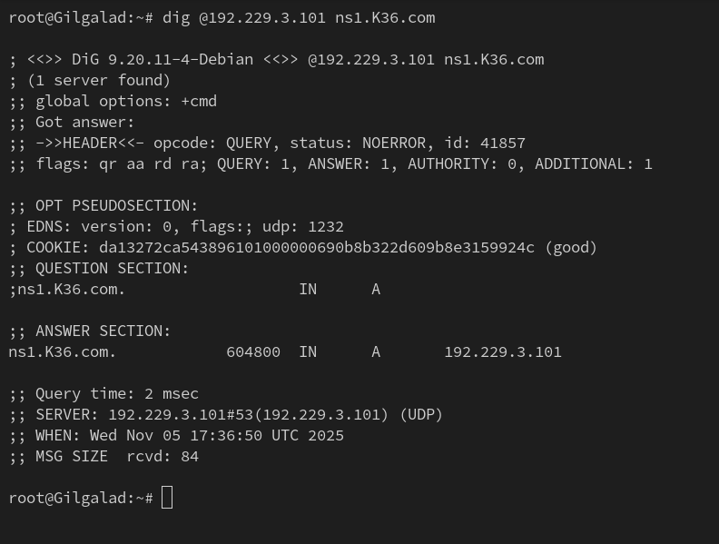  
</p>

<p align="center">
	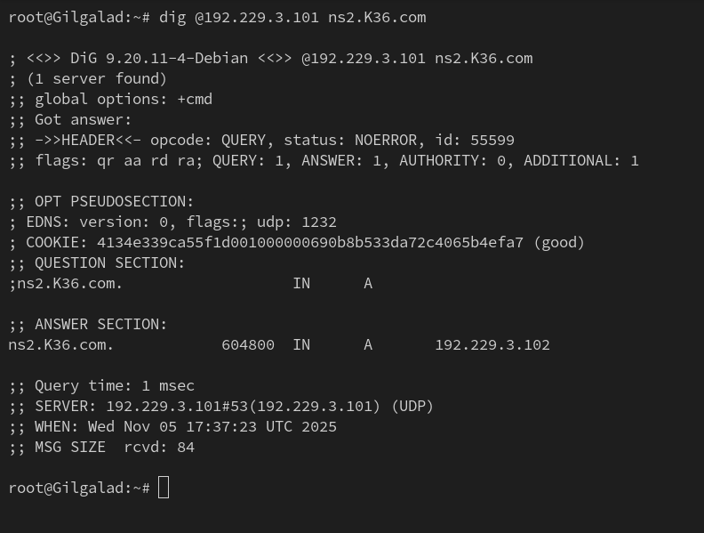  
</p>

<p align="justify">
&emsp; Berdasarkan screenshot di atas, dapat disimpulkan bahwasannya Amdir berhasil menyalin zona <code>K36.com</code> dari Erendis dan memiliki hak otoritatif untuk zona tersebut. Hal ini diindikasikan pada output command <code>dig</code>, khususnya pada bagian <code>flags</code> yang menyatakan flag <code>aa</code> atau Authoritative Answer.
</p>

### • Soal 5

<blockquote>
	<ol start="5">
		<li>
			<p align="justify">
				Untuk memudahkan, nama alias www.&lt;xxxx&gt;.com dibuat untuk peta utama &lt;xxxx&gt;.com. Reverse PTR juga dibuat agar lokasi Erendis dan Amdir dapat dilacak dari alamat fisik tanahnya. Erendis juga menambahkan pesan rahasia (TXT record) pada petanya: "Cincin Sauron" yang menunjuk ke lokasi Elros, dan "Aliansi Terakhir" yang menunjuk ke lokasi Pharazon. Pastikan Amdir juga mengetahui pesan rahasia ini.
			</p>
		</li>
	</ol>
</blockquote>

<p align="justify">
&emsp; Langkah pertama adalah menambahkan Canonical Name Record (CNAME) atau suatu alias untuk nama domain <code>www.K36.com</code>. Di mana langkah implementasinya:
</p>

1. Memperbarui file `/etc/bind/ns1/K36.com` dan menambahkan klausa Canonical Name Record (CNAME) untuk nama domain `www.K36.com`:

```bash
cat > /etc/bind/ns1/K36.com <<'EOF'
$TTL    604800          ; Waktu cache default (detik)
@       IN      SOA     ns1.K36.com. root.K36.com. (
                        2025100401 ; Serial (format YYYYMMDDXX)
                        604800     ; Refresh (1 minggu)
                        86400      ; Retry (1 hari)
                        2419200    ; Expire (4 minggu)
                        604800 )   ; Negative Cache TTL
;

@       IN      NS      ns1.K36.com.
@       IN      NS      ns2.K36.com.

ns1         IN      A       192.229.3.101  ; IP Erendis
ns2         IN      A       192.229.3.102  ; IP Amdir
@           IN      A       192.229.3.101  ; IP Erendis

elendil     IN      A       192.229.1.101  ; IP Elendil
isildur     IN      A       192.229.1.102  ; IP Isildur
anarion     IN      A       192.229.1.103  ; IP Anarion
elros       IN      A       192.229.1.105  ; IP Elros
galadriel   IN      A       192.229.2.101  ; IP Galadriel
celeborn    IN      A       192.229.2.102  ; IP Celeborn
oropher     IN      A       192.229.2.103  ; IP Oropher
pharazon    IN      A       192.229.2.105  ; IP Pharazon
palantir    IN      A       192.229.4.102  ; IP Palantir

www         IN      CNAME   K36.com.
EOF
```

<p align="justify">
&emsp; Selain itu, untuk dapat membuat zona Reverse DNS pada Erendis, maka langkah pertama adalah kita perlu memperbarui konfigurasi domain terlebih dahulu pada file <code>/etc/bind/named.conf.local</code>. Di mana langkah implementasinya adalah:
</p>

2. Menambahkan klausa pada file konfigurasi `/etc/bind/named.conf.local` yang menetapkan zona Reverse DNS `3.229.192.in-addr.arpa` dengan tipe `master` untuk Erendis dan mengaktifkan `notify` dan `allow-transfer` ke node **Amdir**.

```bash
cat >> /etc/bind/named.conf.local <<'EOF'

zone "3.229.192.in-addr.arpa" {
        type master;
        file "/etc/bind/ns1/3.229.192.in-addr.arpa";
        allow-transfer { 192.229.3.102; };
        also-notify { 192.229.3.102; };
        notify yes;
};
EOF
```

<p align="justify">
Langkah selanjutnya adalah membuat file zona Reverse DNS otoritatif pada Erendis, di mana ketentuannya:
	<ul>
		<li>
			Start of Authority (SOA) yang merujuk ke nama domain <code>ns1.K36.com</code>.
		</li>
		<li>
			Nameserver Record (NS) untuk nama domain <code>ns1.K36.com</code> dan <code>ns2.K36.com</code>.
		</li>
		<li>
			Pointer Record (PTR) untuk nama domain <code>ns1.K36.com</code> yang merujuk ke IP address dari node <b>Erendis</b>. 
		</li>
		<li>
			Pointer Record (PTR) untuk nama domain <code>ns2.K36.com</code> yang merujuk ke IP address dari node <b>Amdir</b>. 
		</li>
	</ul>
Dengan langkah implementasinya:
</p>

3. Menyalin file template ke direktori `/etc/bind/ns1` dengan nama `3.229.192.in-addr.arpa`.

```bash
cp /etc/bind/zone.template /etc/bind/ns1/3.229.192.in-addr.arpa
```

4. Mengubah isi file template dan menyesuaikannya dengan ketentuan soal.

```bash
cat > /etc/bind/ns1/3.229.192.in-addr.arpa <<'EOF'
$TTL    604800          ; Waktu cache default (detik)
@       IN      SOA     ns1.K36.com. root.K36.com. (
                        2025100401 ; Serial (format YYYYMMDDXX)
                        604800     ; Refresh (1 minggu)
                        86400      ; Retry (1 hari)
                        2419200    ; Expire (4 minggu)
                        604800 )   ; Negative Cache TTL
;

@       IN      NS      ns1.K36.com.
@       IN      NS      ns2.K36.com.

101     IN      PTR     ns1.K36.com.
102     IN      PTR     ns2.K36.com.
EOF
```

<p align="justify">
&emsp; Langkah selanjutnya adalah menambahkan Text Record (TXT) yang berisi <code>"Cincin Sauron"</code> untuk nama domain <code>elros.K36.com</code> dan <code>"Aliansi Terakhir"</code> untuk nama domain <code>pharazon.K36.com</code>. Di mana langkah implementasinya adalah:
</p>

5. Memperbarui file `/etc/bind/ns1/K36.com` dan menambahkan klausa Text Record (TXT) untuk nama domain `elros.K36.com` dan `pharazon.K36.com`.

```bash
cat > /etc/bind/ns1/K36.com <<'EOF'
$TTL    604800          ; Waktu cache default (detik)
@       IN      SOA     ns1.K36.com. root.K36.com. (
                        2025100402 ; Serial (format YYYYMMDDXX)
                        604800     ; Refresh (1 minggu)
                        86400      ; Retry (1 hari)
                        2419200    ; Expire (4 minggu)
                        604800 )   ; Negative Cache TTL
;

@       IN      NS      ns1.K36.com.
@       IN      NS      ns2.K36.com.

ns1         IN      A       192.229.3.101  ; IP Erendis
ns2         IN      A       192.229.3.102  ; IP Amdir
@           IN      A       192.229.3.101  ; IP Erendis

elendil     IN      A       192.229.1.101  ; IP Elendil
isildur     IN      A       192.229.1.102  ; IP Isildur
anarion     IN      A       192.229.1.103  ; IP Anarion
elros       IN      A       192.229.1.105  ; IP Elros
galadriel   IN      A       192.229.2.101  ; IP Galadriel
celeborn    IN      A       192.229.2.102  ; IP Celeborn
oropher     IN      A       192.229.2.103  ; IP Oropher
pharazon    IN      A       192.229.2.105  ; IP Pharazon
palantir    IN      A       192.229.4.102  ; IP Palantir

www         IN      CNAME   K36.com.

elros       IN      TXT    "Cincin Sauron"
pharazon    IN      TXT    "Aliansi Terakhir"
EOF
```

6. Memperbarui serial dari SOA file `/etc/bind/ns1/K36.com` dari yang awalnya bernilai `2025100401` menjadi `2025100402`.

7. Melakukan restart pada service `bind9`.

```bash
service bind9 restart
```

<p align="justify">
&emsp; Selain itu, kita perlu memverifikasi bahwasannya query Text (TXT) terhadap <code>elros.K36.com</code> dan <code>pharazon.K36.com</code>, serta alias untuk nama domain <code>www.K36.com</code> berhasil ter-resolve ke tujuan yang benar dan konsisten. Di mana hal ini dapat dilakukan dengan menjalankan command <code>dig</code> untuk query Text (TXT) dan command <code>host</code> untuk query Canonical Name Record (CNAME). Menggunakan <b>Gilgalad</b> sebagai contoh:
</p>

<p align="center">
	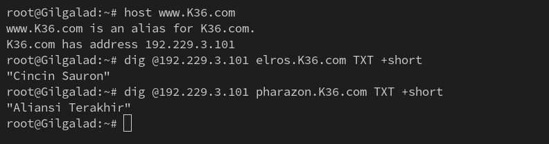  
</p>

<p align="justify">
&emsp; Begitu pula, kita perlu memverifikasi dan memastikan bahwasannya Amdir berhasil menyalin pembaruan konfigurasi yang dilakukan pada Erendis. Di mana kita dapat menggunakan command:
</p>

```bash
dig @192.229.3.102 K36.com SOA +short
```

<p align="center">
	  
</p>

<p align="justify">
&emsp; Berdasarkan screenshot di atas, dapat disimpulkan bahwasannya Amdir berhasil pembaruan konfigurasi yang dilakukan pada Erendis, dibuktikan dengan serial dari SOA yang telah diperbarui.
</p>

<p align="justify">
&emsp; Selepas itu, kita juga perlu memperbarui konfigurasi Reverse DNS pada node Amdir. Di mana langkah implementasinya adalah:
</p>

8. Menambahkan klausa pada file konfigurasi `/etc/bind/named.conf.local` yang menetapkan zona Reverse DNS `3.229.192.in-addr.arpa` dengan tipe `slave` untuk Amdir.

```bash
cat >> /etc/bind/named.conf.local <<'EOF'

zone "3.229.192.in-addr.arpa" {
        type slave;
        masters { 192.229.3.101; };
        file "/etc/bind/ns1/3.229.192.in-addr.arpa";
};
EOF
```

9. Melakukan restart pada service `bind9`.

```bash
service bind9 restart
```

<p align="justify">
&emsp; Setelah itu, kita perlu memastikan bahwasannya zona Reverse DNS pada Erendis dan Amdir dapat berjalan dan dihubungkan ke nama domain yang berkaitan. Di mana kita dapat menggunakan command:
</p>

```bash
host 192.229.3.101
host 192.229.3.102
```

<p align="justify">
Menggunakan <b>Gilgalad</b> sebagai contoh:
</p>

<p align="center">
	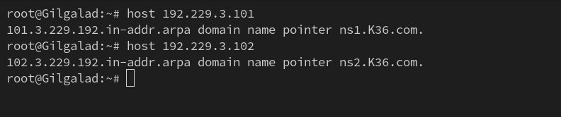  
</p>

<p align="justify">
&emsp; Juga, kita perlu memperbarui konfigurasi DNS Forwarder pada Minastir untuk menambahkan node DNS Master dan Slave beserta Reverse DNS-nya sebagai server. Di mana langkah implementasinya:  
</p>

10. Memperbarui file konfigurasi `/etc/dnsmasq.conf` dan menambahkan IP address dari `Erendis` dan `Amdir` beserta Reverse DNS-nya.

```bash
cat > /etc/dnsmasq.conf << 'EOF'
no-resolv
no-poll

interface=eth0
bind-interfaces
server=/K36.com/192.229.3.101
server=/K36.com/192.229.3.102
server=/3.229.192.in-addr.arpa/192.229.3.101
server=/3.229.192.in-addr.arpa/192.229.3.102
server=192.168.122.1
log-queries
log-facility=/var/log/dnsmasq.log
neg-ttl=60
cache-size=500
EOF
```

11. Melakukan restart pada service `dnsmasq`.

```bash
service dnsmasq restart
```

### • Soal 6

<blockquote>
	<ol start="6">
		<li>
			<p align="justify">
				Aldarion menetapkan aturan waktu peminjaman tanah. Ia mengatur:
			</p>
			<ul>
				<li>Client Dinamis Keluarga Manusia dapat meminjam tanah selama setengah jam.</li>
				<li>Client Dinamis Keluarga Peri hanya seperenam jam.</li>
				<li>Batas waktu maksimal peminjaman untuk semua adalah satu jam.</li>
			</ul>
		</li>
	</ol>
</blockquote>

<p align="justify">
&emsp; Langkah pertama adalah memperbarui file konfigurasi DHCP Server dan memperbarui jumlah alokasi lease-time. Di mana langkah implementasinya:
</p>

1. Memperbarui file konfigurasi `/etc/dhcp/dhcpd.conf` dan memperbarui jumlah alokasi lease-time untuk masing-masing subnet sesuai dengan ketentuan soal.

```bash
cat > /etc/dhcp/dhcpd.conf << 'EOF'
max-lease-time 3600;
authoritative;

subnet 192.229.1.0 netmask 255.255.255.0 {
    option routers 192.229.1.1;
    option subnet-mask 255.255.255.0;
    option broadcast-address 192.229.1.255;
    option domain-name-servers 192.229.5.101;
    default-lease-time 1800;
    range 192.229.1.6 192.229.1.34;
    range 192.229.1.68 192.229.1.94;
}

subnet 192.229.2.0 netmask 255.255.255.0 {
    option routers 192.229.2.1;
    option subnet-mask 255.255.255.0;
    option broadcast-address 192.229.2.255;
    option domain-name-servers 192.229.5.101;
    default-lease-time 600;
    range 192.229.2.35 192.229.2.67;
    range 192.229.2.96 192.229.2.121;
}

subnet 192.229.3.0 netmask 255.255.255.0 {
    option routers 192.229.3.1;
    option subnet-mask 255.255.255.0;
    option broadcast-address 192.229.3.255;
    option domain-name-servers 192.229.5.101;
}

host Khamul {
    hardware ethernet 02:42:4c:b6:e5:00;
    fixed-address 192.229.3.95;
}

subnet 192.229.4.0 netmask 255.255.255.0 {
    option routers 192.229.4.1;
    option subnet-mask 255.255.255.0;
    option broadcast-address 192.229.4.255;
    option domain-name-servers 192.229.5.101;
}
EOF
```

2. Melakukan restart pada service `isc-dhcp-server`.

```bash
service isc-dhcp-server restart
```

<p align="justify">
&emsp; Terakhir, kita perlu memastikan bahwasannya jumlah alokasi lease-time yang diberikan untuk setiap subnet sudah mengikuti ketentuan yang baru. Di mana hal ini dapat dilakukan dengan menggunakan command <code>dhcp-lease-list --list</code>:
</p>

<p align="center">
	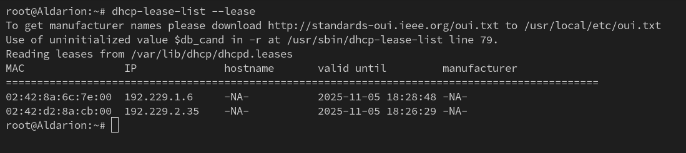  
</p>

<p align="justify">
&emsp; Berdasarkan screenshot di atas, dapat disimpulkan bahwasannya setiap subnet sudah mengikuti jumlah alokasi lease-time yang sesuai dengan ketentuan soal, dibuktikan dengan perbedaan waktu <code>valid until</code> dari masing-masing subnet.
</p>

### • Soal 7

<blockquote>
	<ol start="7">
		<li>
			<p align="justify">
				Para Ksatria Númenor (Elendil, Isildur, Anarion) mulai membangun benteng pertahanan digital mereka menggunakan teknologi Laravel. Instal semua tools yang dibutuhkan (php8.4, composer, nginx) dan dapatkan cetak biru benteng dari Resource-laravel di setiap node worker Laravel. Cek dengan lynx di client.
			</p>
		</li>
	</ol>
</blockquote>

<p align="justify">
&emsp; 	Pada soal ini, kita diminta untuk membuat benteng laravel untuk node Elendil, Isildur, dan Anarion.
</p>

1. Memperbarui daftar package dan menginstal dependensi yang diperlukan.<br>
di masing node (Elendil, Isildur, Anarion):<br>
```bash
apt-get update
apt-get install -y php8.4 php8.4-fpm php8.4-mbstring php8.4-xml php8.4-curl php8.4-zip unzip git nginx composer
```
2. Mengkloning proyek Laravel ke dalam direktori `/var/www/laravel`.
```bash
git clone https://github.com/elshiraphine/laravel-simple-rest-api /var/www/laravel
cd /var/www/laravel
composer install
```
3. Membuat konfigurasi Nginx untuk Laravel pada file `/etc/nginx/sites-available/laravel`.
```bash
cat > /etc/nginx/sites-available/laravel << 'EOF'
server {
    listen 80;
    server_name elendil.numenor.k36.com;
    root /var/www/laravel/public;

    index index.php index.html;
    location / {
        try_files $uri $uri/ /index.php?$query_string;
    }

    location ~ \.php$ {
        include snippets/fastcgi-php.conf;
        fastcgi_pass unix:/var/run/php/php8.4-fpm.sock;
    }

    error_log /var/log/nginx/error.log;
}
EOF
```
4. Mengaktifkan konfigurasi dan me-restart Nginx.
```bash
ln -s /etc/nginx/sites-available/laravel /etc/nginx/sites-enabled/
nginx -t
service nginx restart
```
5. Menguji akses Laravel dari node client (misal Miriel).
```bash
apt install lynx -y
lynx http://192.229.1.101
```

<p align="center">
	  
</p>
<p align="center">
	  
</p>
<p align="center">
	  
</p>

### • Soal 8

<blockquote>
	<ol start="8">
		<li>
			<p align="justify">
				Setiap benteng Númenor harus terhubung ke sumber pengetahuan, Palantir. Konfigurasikan koneksi database di file .env masing-masing worker. Setiap benteng juga harus memiliki gerbang masuk yang unik; atur nginx agar Elendil mendengarkan di port 8001, Isildur di 8002, dan Anarion di 8003. Jangan lupa jalankan migrasi dan seeding awal dari Elendil. Buat agar akses web hanya bisa melalui domain nama, tidak bisa melalui ip.
			</p>
		</li>
	</ol>
</blockquote>

1. Menginstal dan menyalakan layanan MariaDB di node Palantir.
```bash
apt install -y mariadb-server
service mariadb start
```
2. Membuat database dan user untuk Laravel.
```bash
mysql -e "CREATE DATABASE laravel_db;"
mysql -e "CREATE USER 'laravel_user'@'%' IDENTIFIED BY 'laravelpass';"
mysql -e "GRANT ALL PRIVILEGES ON laravel_db.* TO 'laravel_user'@'%';"
mysql -e "FLUSH PRIVILEGES;"
```
3. Mengizinkan koneksi dari luar dengan memodifikasi konfigurasi MariaDB.
```bash
sed -i 's/127.0.0.1/0.0.0.0/' /etc/mysql/mariadb.conf.d/50-server.cnf
service mariadb restart
```
4. Mengonfigurasi file .env di setiap worker Laravel.
```bash
cd /var/www/laravel
nano .env
```
Elendil
```bash
DB_CONNECTION=mysql
DB_HOST=192.229.4.101
DB_PORT=3306
DB_DATABASE=laravel_db
DB_USERNAME=laravel_user
DB_PASSWORD=laravelpass
```
Isildur
```bash
DB_CONNECTION=mysql
DB_HOST=192.229.4.102
DB_PORT=3306
DB_DATABASE=laravel_db
DB_USERNAME=laravel_user
DB_PASSWORD=laravelpass
```
Anarion
```bash
DB_CONNECTION=mysql
DB_HOST=192.229.4.103
DB_PORT=3306
DB_DATABASE=laravel_db
DB_USERNAME=laravel_user
DB_PASSWORD=laravelpass
```

5. Mengubah listen port di masing node (Elendil, Isildur, Anarion) (/etc/nginx/sites-available/laravel)
Elendil
```bash
server {
    listen 8001;
    server_name elendil.k36.com;
    root /var/www/laravel/public;

    index index.php index.html;

    access_log /var/log/nginx/elendil_access.log;
    error_log /var/log/nginx/elendil_error.log;

    location / {
        try_files $uri $uri/ /index.php?$query_string;
    }

    location ~ \.php$ {
        include snippets/fastcgi-php.conf;
        fastcgi_pass unix:/run/php/php8.4-fpm.sock;
    }

    location ~ /\.ht {
        deny all;
    }
}
```
Isildur
```bash
server {
    listen 8002;
    server_name isildur.k36.com;
    root /var/www/laravel/public;

    index index.php index.html;

    access_log /var/log/nginx/isildur_access.log;
    error_log /var/log/nginx/isildur_error.log;

    location / {
        try_files $uri $uri/ /index.php?$query_string;
    }

    location ~ \.php$ {
        include snippets/fastcgi-php.conf;
        fastcgi_pass unix:/run/php/php8.4-fpm.sock;
    }

    location ~ /\.ht {
        deny all;
    }
}
```
Anarion
```bash
server {
    listen 8003;
    server_name anarion.k36.com;
    root /var/www/laravel/public;

    index index.php index.html;

    access_log /var/log/nginx/anarion_access.log;
    error_log /var/log/nginx/anarion_error.log;

    location / {
        try_files $uri $uri/ /index.php?$query_string;
    }

    location ~ \.php$ {
        include snippets/fastcgi-php.conf;
        fastcgi_pass unix:/run/php/php8.4-fpm.sock;
    }

    location ~ /\.ht {
        deny all;
    }
}
```
6. Menjalankan migrasi database.
Masing2 node (Elendil, Isildur, Anarion)
```bash
ln -sf /etc/nginx/sites-available/laravel /etc/nginx/sites-enabled/Laravel
nginx -t && service nginx restart
```

```bash
cd /var/www/laravel
php artisan migrate --seed
```

Koneksi dari Client (contoh Miriel)
```bash
cd /var/www/laravel
php artisan migrate --seed
```

tambahin di `nano /etc/hosts`
```bash
192.229.1.101 elendil.k36.com
192.229.1.102 isildur.k36.com
192.229.1.103 anarion.k36.com
```

Lalu tes di client satu2
```bash
lynx http://elendil.k36.com:8001
lynx http://isildur.k36.com:8002
lynx http://anarion.k36.com:8003
```

Saat mencoba `lynx http://192.229.1.101:8001` bakal 403 forbidden

<p align="center">
	  
</p>
<p align="center">
	  
</p>
<p align="center">
	  
</p>
<p align="center">
	  
</p>
<p align="center">
	  
</p>
<p align="center">
	  
</p>

### • Soal 9

<blockquote>
	<ol start="9">
		<li>
			<p align="justify">
				Pastikan setiap benteng berfungsi secara mandiri. Dari dalam node client masing-masing, gunakan lynx untuk melihat halaman utama Laravel dan curl /api/airing untuk memastikan mereka bisa mengambil data dari Palantir.
		</li>
	</ol>
</blockquote>

<p align="justify">
&emsp; 	Pada soal ini, kita akan melakukannya di node client
</p>

Miriel
```bash
curl http://elendil.k36.com:8001/api/airing
```
<p align="justify">
&emsp; 	Maka akan mnghasilkan `data: [] , messages: `successed``
</p>


### • Soal 10

<blockquote>
	<ol start="10">
		<li>
			<p align="justify">
				Pemimpin bijak Elros ditugaskan untuk mengkoordinasikan pertahanan Númenor. Konfigurasikan nginx di Elros untuk bertindak sebagai reverse proxy. Buat upstream bernama kesatria_numenor yang berisi alamat ketiga worker (Elendil, Isildur, Anarion). Atur agar semua permintaan yang datang ke domain elros.&lt;xxxx&gt;.com diteruskan secara merata menggunakan algoritma Round Robin ke backend.
			</p>
		</li>
	</ol>
</blockquote>

masing2 Elendil, Ilsidur, Anarion (nambahin Elros.k36.com)<br>
```bash
nano /etc/nginx/sites-available/Laravel
```


### • Soal 11

<blockquote>
	<ol start="11">
		<li>
			<p align="justify">
				Musuh mencoba menguji kekuatan pertahanan Númenor. Dari node client, luncurkan serangan benchmark (ab) ke elros.&lt;xxxx&gt;.com/api/airing/:
			</p>
			<ul>
				<li>Serangan Awal: -n 100 -c 10 (100 permintaan, 10 bersamaan).</li>
				<li>Serangan Penuh: -n 2000 -c 100 (2000 permintaan, 100 bersamaan). Pantau kondisi para worker dan periksa log Elros untuk melihat apakah ada worker yang kewalahan atau koneksi yang gagal.</li>
				<li>Strategi Bertahan: Tambahkan weight dalam algoritma, kemudian catat apakah lebih baik atau tidak.</li>
			</ul>
		</li>
	</ol>
</blockquote>

### • Soal 12

<blockquote>
	<ol start="12">
		<li>
			<p align="justify">
				Para Penguasa Peri (Galadriel, Celeborn, Oropher) membangun taman digital mereka menggunakan PHP. Instal nginx dan php8.4-fpm di setiap node worker PHP. Buat file index.php sederhana di /var/www/html masing-masing yang menampilkan nama hostname mereka. Buat agar akses web hanya bisa melalui domain nama, tidak bisa melalui ip.
			</p>
		</li>
	</ol>
</blockquote>

<p align="justify">
&emsp; Untuk dapat menampilkan hostname saat mengakses web, maka kita perlu mengkonfigurasi terlebih dahulu Galadriel, Celeborn, dan Oropher sebagai <b>PHP Worker</b>. Di mana langkah implementasinya:
</p>

1. Memperbarui daftar package yang ada pada apt-get.

```bash
apt-get update
```

2. Menginstall `nginx` dan `php-fpm`.

```bash
apt-get install nginx php-fpm -y
```

3. Membuat direktori `/var/www/html`.

```bash
mkdir -p /var/www/html/
```

4. Membuat file `index.php` pada `/var/www/html` dan mengkonfigurasikannya untuk menampilkan hostname.


```bash
echo "<?php echo gethostname(); ?>" > /var/www/html/index.php
```

5. Membuat file konfigurasi `/etc/nginx/sites-available/[PHP Worker]` dan menetapkan akses web menggunakan nama domain.

#### a. Galadriel

```bash
cat > /etc/nginx/sites-available/galadriel <<'EOF'
server {
    listen 80;
    server_name galadriel.K36.com;

    root /var/www/html;
    index index.php;

    location / {
        try_files $uri $uri/ /index.php$is_args$args;
    }

    location ~ \.php$ {
        include snippets/fastcgi-php.conf;
        fastcgi_pass unix:/run/php/php8.4-fpm.sock;
    }
}
EOF
```

#### b. Celeborn

```bash
cat > /etc/nginx/sites-available/celeborn <<'EOF'
server {
    listen 80;
    server_name celeborn.K36.com;

    root /var/www/html;
    index index.php;

    location / {
        try_files $uri $uri/ /index.php$is_args$args;
    }

    location ~ \.php$ {
        include snippets/fastcgi-php.conf;
        fastcgi_pass unix:/run/php/php8.4-fpm.sock;
    }
}
EOF
```

#### c. Oropher

```bash
cat > /etc/nginx/sites-available/oropher <<'EOF'
server {
    listen 80;
    server_name oropher.K36.com;

    root /var/www/html;
    index index.php;

    location / {
        try_files $uri $uri/ /index.php$is_args$args;
    }

    location ~ \.php$ {
        include snippets/fastcgi-php.conf;
        fastcgi_pass unix:/run/php/php8.4-fpm.sock;
    }
}
EOF
```

6. Membuat file konfigurasi `/etc/nginx/sites-available/reject` dan menetapkan `Error 404` untuk akses web selain menggunakan nama domain.

```bash
cat > /etc/nginx/sites-available/reject <<'EOF'
server {
    listen 80 default_server;
    server_name _;

    return 404;
}
EOF
```

7. Membuat link simbolik `/etc/nginx/sites-enabled/` yang merujuk ke `/etc/nginx/sites-available/[PHP Worker]`.

#### a. Galadriel

```bash
ln -s /etc/nginx/sites-available/galadriel /etc/nginx/sites-enabled/
```

#### b. Celeborn

```bash
ln -s /etc/nginx/sites-available/celeborn /etc/nginx/sites-enabled/
```

#### c. Oropher

```bash
ln -s /etc/nginx/sites-available/oropher /etc/nginx/sites-enabled/
```

8. Membuat link simbolik `/etc/nginx/sites-enabled/` yang merujuk ke `/etc/nginx/sites-available/reject`.

```bash
ln -s /etc/nginx/sites-available/reject /etc/nginx/sites-enabled/
```

9. Menghapus konfigurasi default dari `nginx`.

```bash
rm /etc/nginx/sites-enabled/default
```

10. Melakukan restart pada service `nginx` dan `php8.4-fpm`.

```bash
service php8.4-fpm restart
service nginx restart
```

<p align="justify">
&emsp; Terakhir, kita perlu memastikan bahwasannya akses web ke dari masing-masing PHP Worker sudah mengikuti ketentuan soal, di mana akses hanya bisa melalui nama domain dan tidak melalui IP address dari masing-masing PHP worker. Di mana hal ini dapat dilakukan dengan menggunakan command <code>curl</code>. Menggunakan Gilgalad sebagai contoh:
</p>

<p align="center">
	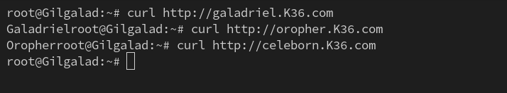  
</p>

<p align="center">
	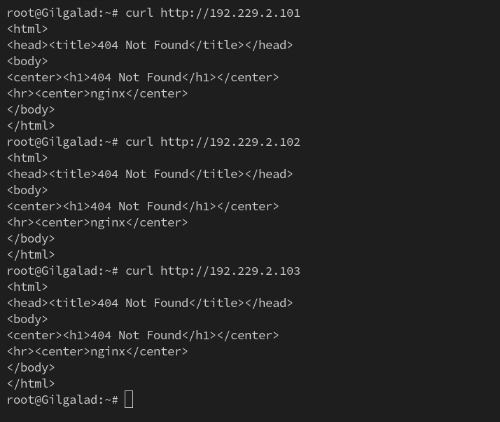  
</p>

### • Soal 13

<blockquote>
	<ol start="13">
		<li>
			<p align="justify">
				Setiap taman Peri harus dapat diakses. Konfigurasikan nginx di setiap worker PHP untuk meneruskan permintaan file .php ke socket php-fpm yang sesuai. Atur agar Galadriel mendengarkan di port 8004, Celeborn di 8005, dan Oropher di 8006.
			</p>
		</li>
	</ol>
</blockquote>

<p align="justify">
&emsp; Untuk dapat mengatur port yang digunakan oleh PHP worker saat ingin mengakses web, maka kita perlu memperbarui konfigurasi PHP yang ada pada Galadriel, Celeborn, dan Oropher. Di mana langkah implementasinya:
</p>

1. Memperbarui file konfigurasi `/etc/nginx/sites-available/[PHP Worker]` dan memperbarui port yang digunakan PHP worker untuk mendengar.

#### a. Galadriel

```bash
cat > /etc/nginx/sites-available/galadriel <<'EOF'
server {
    listen 8004;
    server_name galadriel.K36.com;

    root /var/www/html;
    index index.php;

    location / {
        try_files $uri $uri/ /index.php$is_args$args;
    }

    location ~ \.php$ {
        include snippets/fastcgi-php.conf;
        fastcgi_pass unix:/run/php/php8.4-fpm.sock;
    }
}
EOF
```

#### b. Celeborn

```bash
cat > /etc/nginx/sites-available/celeborn <<'EOF'
server {
    listen 8005;
    server_name celeborn.K36.com;

    root /var/www/html;
    index index.php;

    location / {
        try_files $uri $uri/ /index.php$is_args$args;
    }

    location ~ \.php$ {
        include snippets/fastcgi-php.conf;
        fastcgi_pass unix:/run/php/php8.4-fpm.sock;
    }
}
EOF
```

#### c. Oropher

```bash
cat > /etc/nginx/sites-available/oropher <<'EOF'
server {
    listen 8006;
    server_name oropher.K36.com;

    root /var/www/html;
    index index.php;

    location / {
        try_files $uri $uri/ /index.php$is_args$args;
    }

    location ~ \.php$ {
        include snippets/fastcgi-php.conf;
        fastcgi_pass unix:/run/php/php8.4-fpm.sock;
    }
}
EOF
```

2. Melakukan restart pada service `nginx` dan `php8.4-fpm`.

```bash
service php8.4-fpm restart
service nginx restart
```

<p align="justify">
&emsp; Terakhir, kita perlu memastikan bahwasannya akses web ke dari masing-masing PHP Worker hanya bisa diakses melalui port yang telah ditetapkan pada ketentuan soal. Di mana hal ini dapat dilakukan dengan menggunakan command <code>curl</code>. Menggunakan Gilgalad sebagai contoh:
</p>

<p align="center">
	  
</p>

<p align="center">
	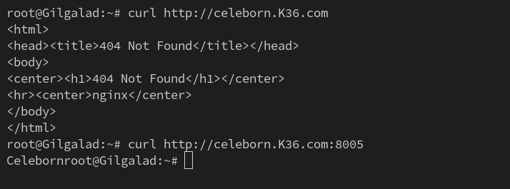  
</p>

<p align="center">
	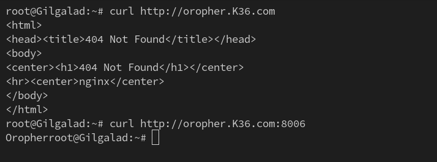  
</p>

### • Soal 14

<blockquote>
	<ol start="14">
		<li>
			<p align="justify">
				Keamanan adalah prioritas. Terapkan Basic HTTP Authentication pada nginx di setiap worker PHP, sehingga hanya mereka yang tahu kata sandi (user: noldor, pass: silvan) yang bisa masuk.
			</p>
		</li>
	</ol>
</blockquote>

<p align="justify">
&emsp; Untuk dapat menerapkan Basic HTTP Authentication saat ingin mengakses web, maka kita perlu menyimpan <code>username:password</code> yang ingin digunakan dan memperbarui konfigurasi PHP yang ada pada Galadriel, Celeborn, dan Oropher. Di mana langkah implementasinya:
</p>

1. Memperbarui daftar package yang ada pada apt-get.

```bash
apt-get update
```

2. Menginstall `apache2-utils`.

```bash
apt-get install apache2-utils -y
```

3. Menyimpan `username:password` yang ingin digunakan sesuai dengan ketentuan soal pada file `/etc/nginx/.htpasswd`.

```bash
htpasswd -cb /etc/nginx/.htpasswd noldor silvan
```

4. Memperbarui file konfigurasi `/etc/nginx/sites-available/[PHP Worker]` dan menambahkan klausa untuk menerapkan Basic HTTP Authentication saat mengakses web.

#### a. Galadriel

```bash
cat > /etc/nginx/sites-available/galadriel <<'EOF'
server {
    listen 8004;
    server_name galadriel.K36.com;

    auth_basic on;
    auth_basic_user_file /etc/nginx/.htpasswd;

    root /var/www/html;
    index index.php;

    location / {
        try_files $uri $uri/ /index.php$is_args$args;
    }

    location ~ \.php$ {
        include snippets/fastcgi-php.conf;
        fastcgi_pass unix:/run/php/php8.4-fpm.sock;
    }
}
EOF
```

#### b. Celeborn

```bash
cat > /etc/nginx/sites-available/celeborn <<'EOF'
server {
    listen 8005;
    server_name celeborn.K36.com;

    auth_basic on;
    auth_basic_user_file /etc/nginx/.htpasswd;

    root /var/www/html;
    index index.php;

    location / {
        try_files $uri $uri/ /index.php$is_args$args;
    }

    location ~ \.php$ {
        include snippets/fastcgi-php.conf;
        fastcgi_pass unix:/run/php/php8.4-fpm.sock;
    }
}
EOF
```

#### c. Oropher

```bash
cat > /etc/nginx/sites-available/oropher <<'EOF'
server {
    listen 8006;
    server_name oropher.K36.com;

    auth_basic on;
    auth_basic_user_file /etc/nginx/.htpasswd;

    root /var/www/html;
    index index.php;

    location / {
        try_files $uri $uri/ /index.php$is_args$args;
    }

    location ~ \.php$ {
        include snippets/fastcgi-php.conf;
        fastcgi_pass unix:/run/php/php8.4-fpm.sock;
    }
}
EOF
```

5. Melakukan restart pada service `nginx` dan `php8.4-fpm`.

```bash
service php8.4-fpm restart
service nginx restart
```

<p align="justify">
&emsp; Terakhir, kita perlu memastikan bahwasannya akses web ke dari masing-masing PHP Worker hanya bisa diakses melalui port dan <code>username:password</code> yang telah ditetapkan pada ketentuan soal. Di mana hal ini dapat dilakukan dengan menggunakan command <code>curl</code>. Menggunakan Gilgalad sebagai contoh:
</p>

<p align="center">
	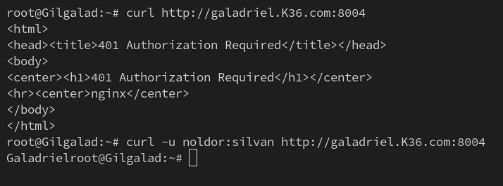  
</p>

<p align="center">
	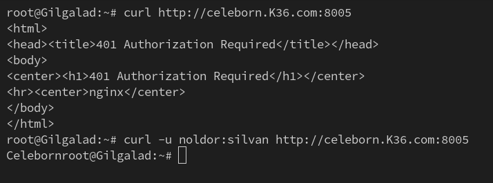  
</p>

<p align="center">
	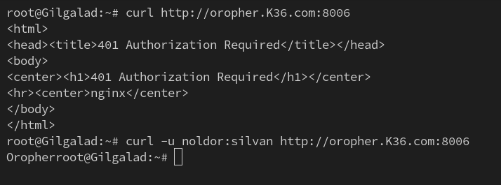  
</p>

### • Soal 15

<blockquote>
	<ol start="15">
		<li>
			<p align="justify">
				Para Peri ingin tahu siapa yang mengunjungi taman mereka. Modifikasi konfigurasi Nginx di worker PHP untuk menambahkan header X-Real-IP yang akan diteruskan ke PHP. Ubah file index.php untuk menampilkan alamat IP pengunjung asli saat ini.
			</p>
		</li>
	</ol>
</blockquote>

<p align="justify">
&emsp; Untuk dapat menampilkan IP address asli dari pengunjung yang mengakses web, maka kita perlu memperbarui file <code>index.php</code> dan memperbarui konfigurasi PHP yang ada pada Galadriel, Celeborn, dan Oropher. Di mana langkah implementasinya:
</p>

1. Memperbarui file konfigurasi `/etc/nginx/sites-available/[PHP Worker]` dan menambahkan klausa untuk menerapkan X-Real-IP saat mengakses web.

#### a. Galadriel

```bash
cat > /etc/nginx/sites-available/galadriel <<'EOF'
server {
    listen 8004;
    server_name galadriel.K36.com;

    auth_basic on;
    auth_basic_user_file /etc/nginx/.htpasswd;

    root /var/www/html;
    index index.php;

    location / {
        try_files $uri $uri/ /index.php$is_args$args;
    }

    location ~ \.php$ {
        fastcgi_param X-Real-IP $remote_addr;
        include snippets/fastcgi-php.conf;
        fastcgi_pass unix:/run/php/php8.4-fpm.sock;
    }
}
EOF
```

#### b. Celeborn

```bash
cat > /etc/nginx/sites-available/celeborn <<'EOF'
server {
    listen 8005;
    server_name celeborn.K36.com;

    auth_basic on;
    auth_basic_user_file /etc/nginx/.htpasswd;

    root /var/www/html;
    index index.php;

    location / {
        try_files $uri $uri/ /index.php$is_args$args;
    }

    location ~ \.php$ {
        fastcgi_param X-Real-IP $remote_addr;
        include snippets/fastcgi-php.conf;
        fastcgi_pass unix:/run/php/php8.4-fpm.sock;
    }
}
EOF
```

#### c. Oropher

```bash
cat > /etc/nginx/sites-available/oropher <<'EOF'
server {
    listen 8006;
    server_name oropher.K36.com;

    auth_basic on;
    auth_basic_user_file /etc/nginx/.htpasswd;

    root /var/www/html;
    index index.php;

    location / {
        try_files $uri $uri/ /index.php$is_args$args;
    }

    location ~ \.php$ {
        fastcgi_param X-Real-IP $remote_addr;
        include snippets/fastcgi-php.conf;
        fastcgi_pass unix:/run/php/php8.4-fpm.sock;
    }
}
EOF
```

2. Memperbarui isi dari file `index.php` untuk menampilkan IP address asli dari pengunjung yang mengakses web.

```bash
cat > /var/www/html/index.php <<'EOF'
<?php
$hostname = gethostname();
$client_ip = $_SERVER['REMOTE_ADDR'] ?? '???';
echo "Hostname: $hostname\n";
echo "Client IP: $client_ip\n";
?>
EOF
```

3. Melakukan restart pada service `nginx` dan `php8.4-fpm`.

```bash
service php8.4-fpm restart
service nginx restart
```

<p align="justify">
&emsp; Terakhir, kita perlu memastikan bahwasannya akses web ke dari masing-masing PHP Worker hanya bisa diakses melalui port dan <code>username:password</code> yang telah ditetapkan pada ketentuan soal, serta menampilkan IP address dari pengunjung yang mengakses web. Di mana hal ini dapat dilakukan dengan menggunakan command <code>curl</code>. Menggunakan Gilgalad sebagai contoh:
</p>

<p align="center">
	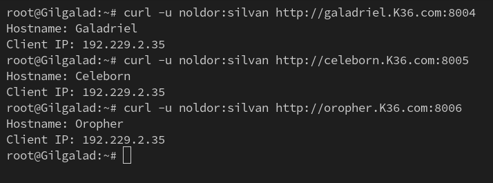  
</p>

### • Soal 16

<blockquote>
	<ol start="16">
		<li>
			<p align="justify">
				Raja Númenor terakhir yang ambisius, Pharazon, mencoba mengawasi taman-taman Peri. Konfigurasikan Nginx di Pharazon sebagai reverse proxy. Buat upstream Kesatria_Lorien berisi alamat ketiga worker PHP. Atur agar permintaan ke pharazon.&lt;xxxx&gt;.com diteruskan ke backend, dan pastikan konfigurasi Nginx di Pharazon juga meneruskan informasi Basic Authentication yang dimasukkan pengguna ke worker.
			</p>
		</li>
	</ol>
</blockquote>

<p align="justify">
&emsp; Untuk mengatur query yang datang ke Pharazon untuk diteruskan ke PHP Worker, maka kita perlu mengkonfigurasi terlebih dahulu Pharazon sebagai <b>Reverse Proxy</b>, sekaligus sebagai <b>Load Balancer</b>. Di mana langkah implementasinya:
</p>

1. Memperbarui daftar package yang ada pada apt-get.

```bash
apt-get update
```

2. Menginstall `nginx`.

```bash
apt-get install nginx -y
```

3. Membuat file konfigurasi `/etc/nginx/conf.d/upstream.conf` dan menetapkan nama domain dari PHP Worker sebagai server.

```bash
cat > /etc/nginx/conf.d/upstream.conf <<'EOF'
upstream Kesatria_Lorien {
    server galadriel.K36.com:8004;
    server celeborn.K36.com:8005;
    server oropher.K36.com:8006;
    keepalive 16;
}
EOF
```

4. Membuat file konfigurasi `/etc/nginx/sites-available/pharazon` dan menetapkan Pharazon sebagai Reverse Proxy dan Load Balancer.

```bash
cat > /etc/nginx/sites-available/pharazon <<'EOF'
server {
    listen 80;
    server_name pharazon.K36.com;

    resolver 192.229.5.101 valid=300s;
    
    location / {
        proxy_pass http://Kesatria_Lorien;
        proxy_http_version 1.1;
        
        proxy_set_header Host $host;
        
        proxy_set_header X-Real-IP $remote_addr;
        proxy_set_header X-Forwarded-For $proxy_add_x_forwarded_for;
        proxy_set_header X-Forwarded-Host $host;
        proxy_set_header X-Forwarded-Proto $scheme;

        proxy_set_header Authorization $http_authorization;
    }
}
EOF
```

5. Membuat link simbolik `/etc/nginx/sites-enabled/` yang merujuk ke `/etc/nginx/sites-available/pharazon`.

```bash
ln -s /etc/nginx/sites-available/pharazon /etc/nginx/sites-enabled/
```

6. Menghapus konfigurasi default dari `nginx`.

```bash
rm -f /etc/nginx/sites-enabled/default
```

7. Melakukan restart pada service `nginx`.

```bash
service nginx restart
```

<p align="justify">
&emsp; Terakhir, kita perlu memastikan bahwasannya Pharazon dapat mengarahkan query yang datang kepada para PHP Worker. Di mana hal ini dapat dilakukan dengan menggunakan command <code>curl</code>. Menggunakan Gilgalad sebagai contoh:
</p>

<p align="center">
	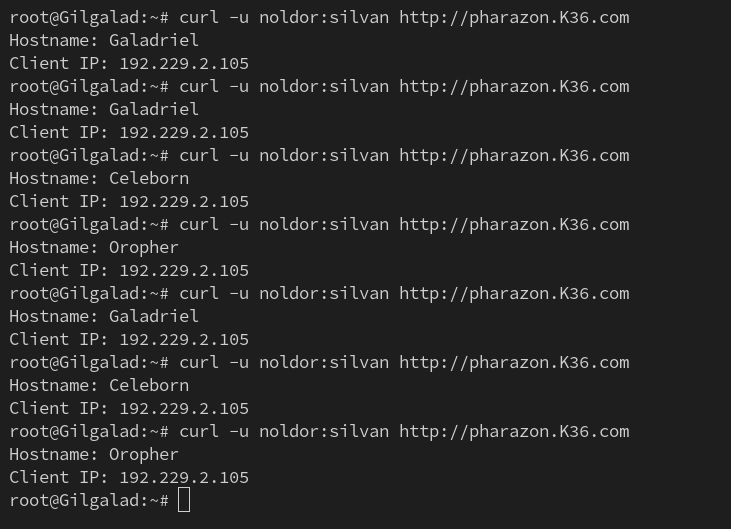  
</p>

### • Soal 17

<blockquote>
	<ol start="17">
		<li>
			<p align="justify">
				Dari node client, lakukan benchmark ke pharazon.&lt;xxxx&gt;.com, jangan lupa menyertakan kredensial autentikasi. Amati distribusi beban ke para worker. Kemudian, simulasikan salah satu taman Peri runtuh (misal: service nginx stop di Galadriel) dan jalankan lagi benchmark. Apakah Pharazon masih bisa mengarahkan pengunjung ke taman yang tersisa? Periksa log Pharazon.
			</p>
		</li>
	</ol>
</blockquote>

<p align="justify">
&emsp; Langkah pertama untuk melalukan benchmark Pharazon adalah memantau error log yang ada pada Pharazon dan menjalankan tes benchmark untuk meilihat apakah ada error yang muncul. Di mana langkah implementasinya:
</p>

1. Memantau file `/var/log/nginx/error.log`.

```bash
tail -f /var/log/nginx/error.log
```

<p align="justify">
Menggunakan Gilgalad untuk mengeksekusi benchmark:
</p>

2. Memperbarui daftar package yang ada pada apt-get.

```bash
apt-get update
```

3. Menginstall `apache2-utils`.

```bash
apt-get install apache2-utils -y
```

4. Menjalankan benchmark menggunakan ApacheBench (ab) dengan ketentuan `300` HTTP request dan `10` concurrency.

```bash
ab -n 300 -c 10 -A noldor:silvan http://pharazon.K36.com/
```

5. Pantau error log pada Pharazon.

<p align="center">
	  
</p>

<p align="justify">
&emsp; Berdasarkan screenshot di atas, dapat disimpulkan bahwasannya belum terdapat error yang muncul pada Pharazon. Hal ini dikarenakan ketiga PHP worker masih berjalan.
</p>

6. Mematikan salah satu PHP worker. Menggunakan Celeborn sebagai contoh.

```bash
service nginx stop
```

7. Menjalankan ulang benchmark menggunakan ApacheBench (ab) dengan ketentuan `300` HTTP request dan `10` concurrency.

```bash
ab -n 300 -c 10 -A noldor:silvan http://pharazon.K36.com/
```

8. Pantau ulang error log pada Pharazon.

<p align="center">
	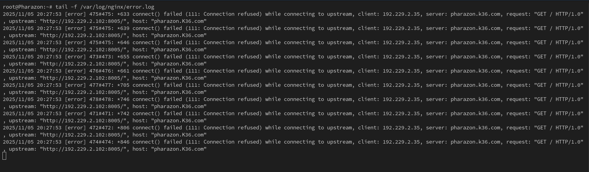  
</p>

<p align="justify">
&emsp; Berdasarkan screenshot di atas, dapat disimpulkan bahwasannya terdapat error yang muncul pada Pharazon. Hal ini dikarenakan Pharazon mencoba berkali-kali untuk meneruskan query ke node Celeborn, meskipun sebelumnya sudah diberhentikan. Pharazon tetap akan mencoba meneruskan query ke Celeborn karena Reverse Proxy di desain dengan tidak menerapkan maksimal jumlah error dan penggunaan metode <b>Round Robin</b> dalam pendistribusian load ke PHP Worker.
</p>

### • Soal 18

<blockquote>
	<ol start="18">
		<li>
			<p align="justify">
				Kekuatan Palantir sangat vital. Untuk melindunginya, konfigurasikan replikasi database Master-Slave menggunakan MariaDB. Jadikan Palantir sebagai Master. Konfigurasikan Narvi sebagai Slave yang secara otomatis menyalin semua data dari Palantir. Buktikan replikasi berhasil dengan membuat tabel baru di Master dan memeriksanya di Slave.
			</p>
		</li>
	</ol>
</blockquote>

<p align="justify">
&emsp; Langkah pertama untuk dapat membuat Database Master dan Slave, di mana slave akan menyalin data dari master, maka kita perlu mengkonfigurasi terlebih dahulu Palantir dan Narvi. Di mana langkah implementasinya:
</p>

#### • Database Master

1. Memperbarui daftar package yang ada pada apt-get.

```bash
apt-get update
```

2. Menginstall `mariadb-server`.

```bash
apt-get install mariadb-server -y
```

3. Membuat file konfigurasi `/etc/mysql/mariadb.conf.d/50-server.cnf` dan menetapkan ID server dari Database Master.

```bash
cat > /etc/mysql/mariadb.conf.d/50-server.cnf <<'EOF'
[mysqld]
server-id=1
log_bin=/var/log/mysql/mariadb-bin.log
bind-address=0.0.0.0
EOF
```

4. Membuat direktori `/var/log/mysql`.

```bash
mkdir -p /var/log/mysql
```

5. Mengalihkan kepemilikan direktori `/var/log/mysql` ke user `mysql`.

```bash
chown mysql:mysql /var/log/mysql
```

6. Melakukan restart pada service `mariadb`.

```bash
service mariadb restart
```

7. Menetapkan user untuk `Narvi`, dan memberikan hak akses untuk menyalin data.

```bash
mysql<<EOF
CREATE USER 'replica'@'192.229.4.103' IDENTIFIED BY 'replicaPass';
GRANT REPLICATION SLAVE ON *.* TO 'replica'@'192.229.4.103';
FLUSH PRIVILEGES;

SHOW MASTER STATUS;
EOF
``` 

#### • Database Slave

8. Memperbarui daftar package yang ada pada apt-get.

```bash
apt-get update
```

9. Menginstall `mariadb-server`.

```bash
apt-get install mariadb-server -y
```

10. Membuat file konfigurasi `/etc/mysql/mariadb.conf.d/50-server.cnf` dan menetapkan ID server dari Database Slave.

```bash
cat > /etc/mysql/mariadb.conf.d/50-server.cnf << 'EOF'
[mysqld]
server-id=2
relay_log=/var/log/mysql/mariadb-relay-bin.log
read_only=1
EOF
```

11. Membuat direktori `/var/log/mysql`.

```bash
mkdir -p /var/log/mysql
```

12. Mengalihkan kepemilikan direktori `/var/log/mysql` ke user `mysql`.

```bash
chown mysql:mysql /var/log/mysql
```

13. Melakukan restart pada service `mariadb`.

```bash
service mariadb restart
```

14. Menetapkan node `Palantir` sebagai Database Master yang akan disalin datanya.

```bash
mysql<<EOF
CHANGE MASTER TO
    MASTER_HOST='192.229.4.102',
    MASTER_USER='replica',
    MASTER_PASSWORD='replicaPass',
    MASTER_LOG_FILE='mariadb-bin.000001',
    MASTER_LOG_POS=1422;

START SLAVE;

SHOW SLAVE STATUS\G;
EOF
```

<p align="justify">
&emsp; Terakhir, kita perlu memastikan bahwasannya Database Slave dapat menyalin data yang dibuat dan tersimpan pada Database Master. Di mana langkah implementasinya:
</p>

#### • Database Master

15. Membuat database dan tabel baru.


```bash
mysql<<EOF
CREATE DATABASE K36DB;
USE K36DB;

CREATE TABLE users (
    id INT AUTO_INCREMENT PRIMARY KEY,
    name VARCHAR(100),
    origin VARCHAR(100)
);

INSERT INTO users (name, origin) VALUES
('Galadhrim', 'Lothlorien'),
('Noldor', 'Valinor');

SHOW TABLES;
SELECT * FROM users;
EOF
```

<p align="center">
	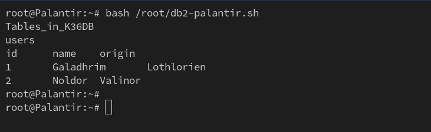  
</p>

#### • Database Slave

16. Memastikan bahwasannya database dan tabel yang dibuat telah berhasil disalin.

```bash
mysql<<EOF
SHOW DATABASES;
USE K36DB;
SHOW TABLES;
SELECT * FROM users;
EOF
```

<p align="center">
	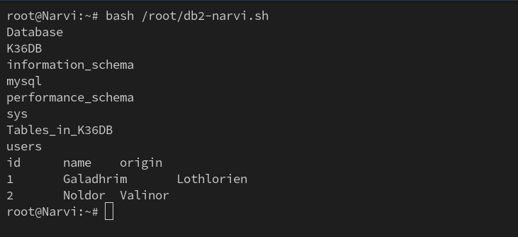  
</p>

### • Soal 19

<blockquote>
	<ol start="19">
		<li>
			<p align="justify">
				Gelombang serangan dari Mordor semakin intens. Implementasikan rate limiting pada kedua Load Balancer (Elros dan Pharazon) menggunakan Nginx. Batasi agar satu alamat IP hanya bisa melakukan 10 permintaan per detik. Uji coba dengan menjalankan ab dari satu client dengan konkurensi tinggi (-c 50 atau lebih) dan periksa log Nginx untuk melihat pesan request yang ditolak atau ditunda karena rate limit.
			</p>
		</li>
	</ol>
</blockquote>


### • Soal 20

<blockquote>
	<ol start="20">
		<li>
			<p align="justify">
				Beban pada para worker semakin berat. Aktifkan Nginx Caching pada Pharazon untuk menyimpan salinan halaman PHP yang sering diakses. Gunakan curl pada domain nama Pharazon dari client untuk memeriksa response header. Buktikan bahwa permintaan kedua dan seterusnya untuk halaman yang sama mendapatkan status HIT dari cache dan tidak lagi membebani worker PHP.
			</p>
		</li>
	</ol>
</blockquote>
